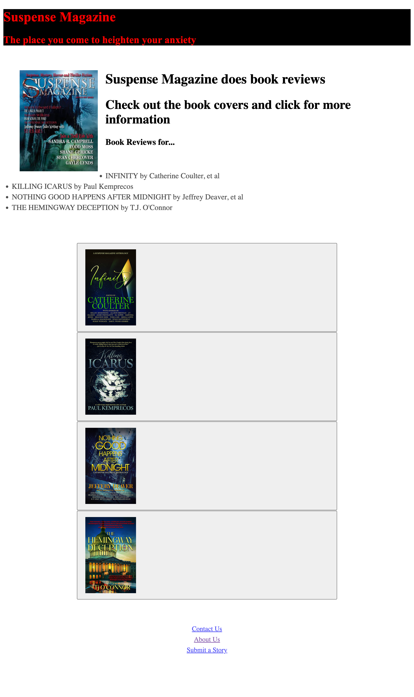

# Module-2
## Module 2 challenge

## User Story

* AS a web devolper I want potential employers to see a portfoloio of my work samples.
  So that I can stand apart from other candidates

## Acceptance Criteria

* It is done when I load my portfolio and have the name of the site, a photo and links on how to contact me, about me and submit to me. 

* It is done when I have links in the images I created to certain books.

* It is done when the website works on smaller sites, like Iphones and Ipads. 

* It is done when my links are setup to the website and email addresses.

* It is done when I have accessiblity in my website. 

## Assets

Here is a picture of the website:

